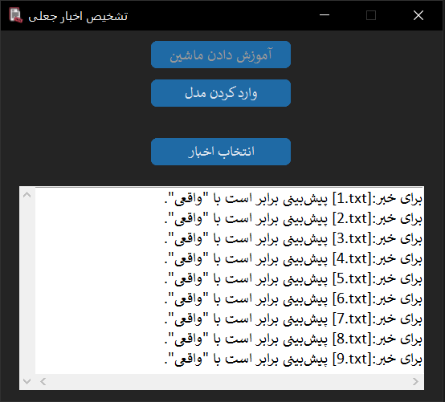

# fake-news-detector

Fake news classifier for English texts with a Persian tkinter GUI, using nltk for NLP preprocessing and scikit-learn’s Logistic Regression.

<div align="center">



</div>

---

## :dart: Features

- ✅ Load and train on custom datasets (`Fake.csv` & `True.csv`)
- 🧠 NLP preprocessing with `NLTK` (stopwords, stemming, cleaning)
- 📊 ML model using `Logistic Regression` and `CountVectorizer`
- 📂 Import `.txt` files and classify news content
- 💾 Save and load trained models (`.pkl`)
- 🖥️ User-friendly **GUI interface** with Persian labels

---

## :inbox_tray: Download Dataset
The required dataset files (Fake.csv and True.csv) are not included in this repository due to size or licensing limits.

To download them:

1. Open the file:

    [dataset in Kaggle.com](https://www.kaggle.com/datasets/clmentbisaillon/fake-and-real-news-dataset)

2. Follow the link inside to manually download the dataset.

3. Place the downloaded files in the `dataset/` directory like so:

```bash
├── dataset/
│   ├── Fake.csv
│   └── True.csv
│   └── dataset-link.txt
```

---

## :clipboard: Prerequisites

To run this project, ensure you have the following installed:
- Python 3.7+
- Required Python libraries:
```bash
pip install pandas numpy nltk scikit-learn customtkinter joblib
```
- NLTK Data:
```python
import nltk
nltk.download('stopwords')
```
**Dataset**: The project expects two CSV files (`Fake.csv` and `True.csv`) in a `dataset` folder. You can use datasets like the Fake and Real News Dataset or provide your own with similar structure.

---

## :hammer_and_wrench: Installation

1. Clone the repository:

```bash
git clone https://github.com/vijeu/fake-news-detector.git
cd fake-news-detector
```

2. Install the required packages:

```bash
pip install -r requirements.txt
```

3. Download NLTK stopwords (only once):

```python
import nltk
nltk.download('stopwords')
```

---

## :pushpin: Notes
- GUI labels and messages are in **Persian (Farsi)**.
- The app focuses on **news titles** only (for simplicity).
- Supports only English-language `.txt` news files.

---

## :page_facing_up: License

This project is licensed under the MIT License. See the LICENSE file for details.